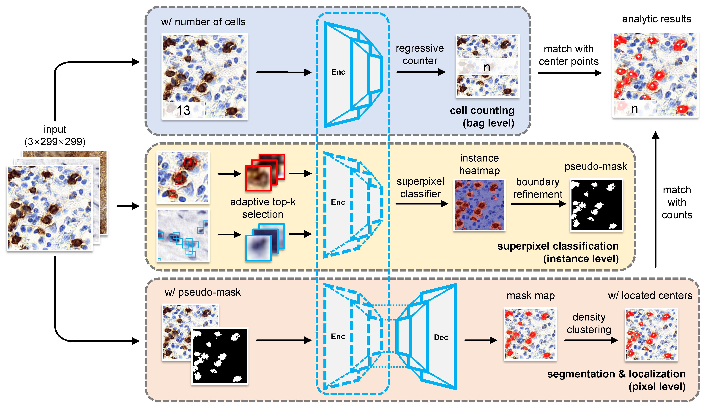
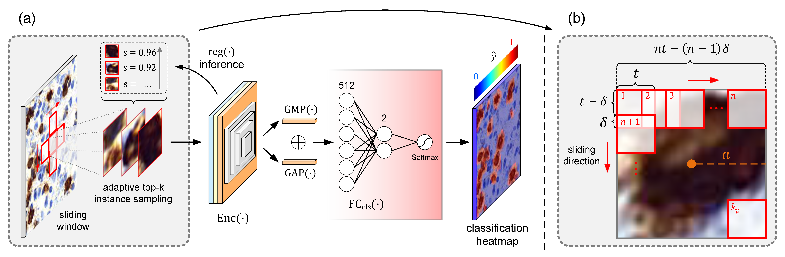

## Multiple Instance Learning for Immune Cell Image Segmentation with Counting Labels

<a href="https://pytorch.org/"></a>

Source code for [PR'26] [A Novel Weakly Supervised Immunohistochemical Cell Segmentation method via Counting Labels](https://www.sciencedirect.com/science/article/pii/S0031320325013470?via%3Dihub).

Special thanks to Hua Ye and Dr. Cheng [@ShenghuaCheng](https://github.com/ShenghuaCheng) for contributing to this work 
and [WNLO](http://wnlo.hust.edu.cn/) for platform provision. 

### New MIL for immune cell pathological images

Taking immunohistochemistry-stained digital cell images as input, the model is merely supervised by positive cell counting labels and transforms whole-image (bag) level counting results into superpixel (instance) level classification results via the specifically designed adaptive top-k instance selection strategy.

### Network frame

- Stage 1: Image-wise regressive positive cell counter
- Stage 2: Superpixel-wise tile instance classifier
- Stage 3: Pixel-wise segmentation encoder-decoder network



### Adaptive top-k selection



### Mask refinement

Instance classifier provides us semantic information of positive cells. 
HSV channel separation and thresholding provide us fine-grained profile of positive cells.

### Grand Challenge results

Kappa = 0.9319, 4th in **Lymphocyte Assessment Hackathon** (LYSTO) Challenge. [Leaderboard](https://lysto.grand-challenge.org/evaluation/challenge/leaderboard/)

### Dataset

Visit [LYSTO](https://lysto.grand-challenge.org/) to get data.

### Quick Start

- Add image data in `./data`
- Train cell counter by `python train_image.py`
- Test your counter by `python test_count.py`
- Train tile classifier by `python train_tile.py`
- Test the classifier and get heatmaps by `python test_tile.py`
- Train segmentation network by `python train_seg.py`
- Test segmentation network and get masks by `python test_seg.py --draw_masks`
- Test segmentation network and get localization points by `python test_seg.py --detect`

and use arguments you like. You can find arguments list in the source code file. 

### Citing

```
@article{ye2026novel,
  title={A novel weakly supervised immunohistochemical cell segmentation method via counting labels},
  author={Ye, Hua and Zhao, Ziwen and Liu, Xiuli and Ma, Jiabo and Liu, Sibo and Zeng, Shaoqun and Cheng, Shenghua},
  journal={Pattern Recognition},
  pages={112684},
  year={2026},
  publisher={Elsevier}
}
```
