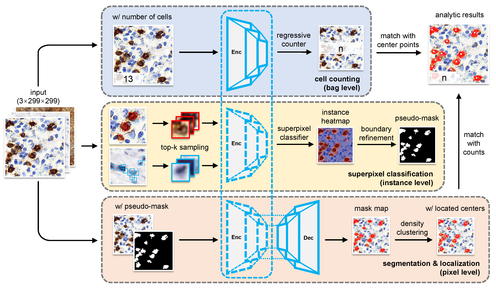

## Semantic Segmentation of Lymphocytes by Multiple Instance Learning

### Dataset
Visit **the Lymphocyte Assessment Hackathon** ([LYSTO](https://lysto.grand-challenge.org/)) Challenge to get data.

### Network frame

... under construction ... stay tuned. 

> 2021 By Newiz
